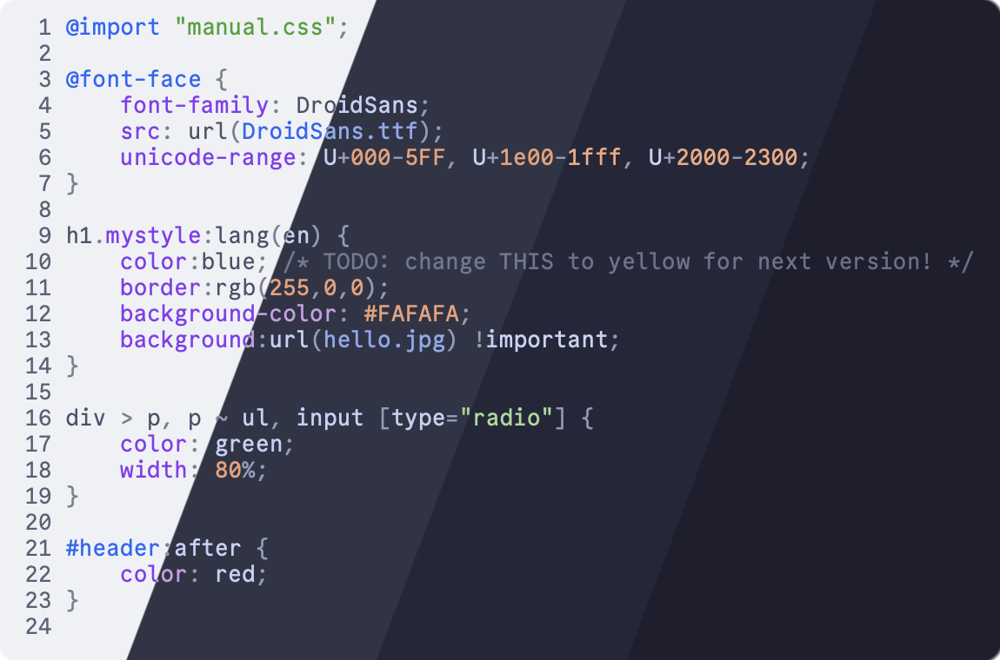
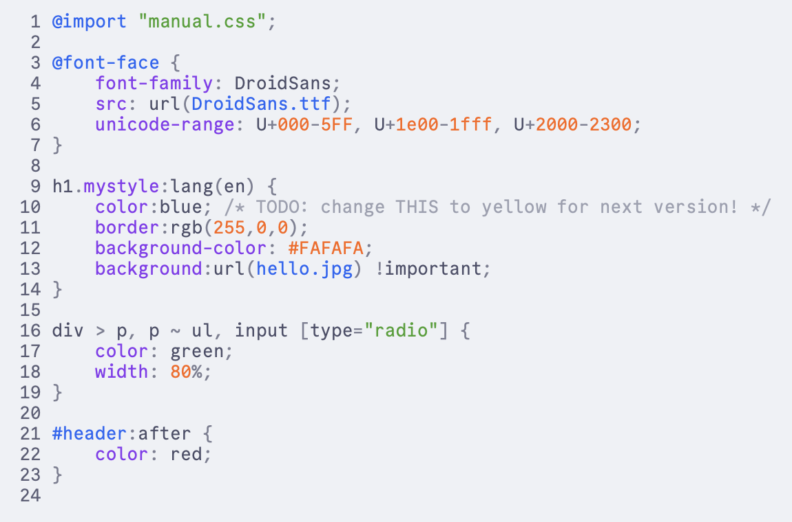
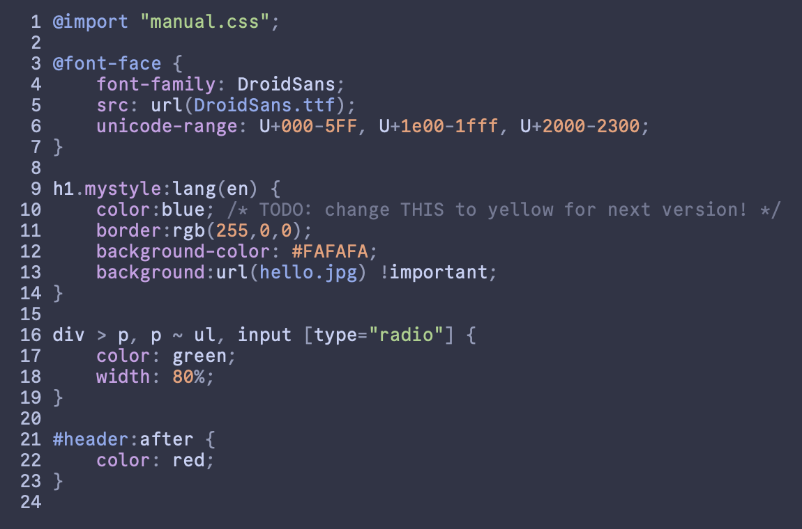
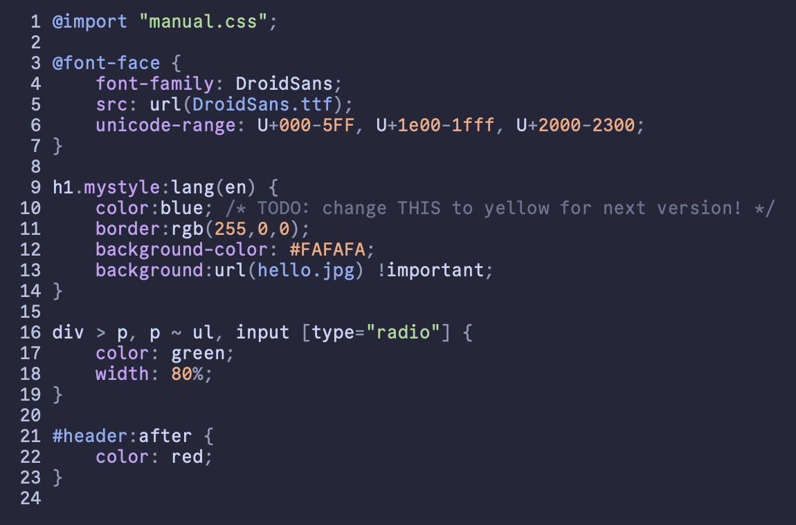
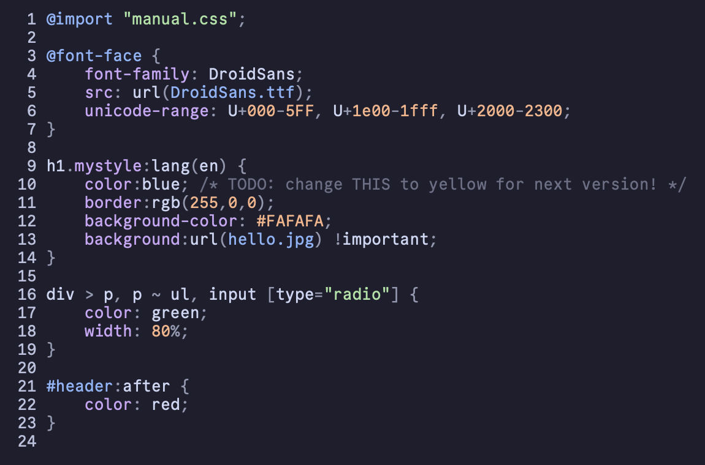

<h3 align="center">
	 
	
	Catppuccin for <a href="http://andre-simon.de/doku/highlight/en/highlight.php">Highlight</a> and <a href="https://github.com/sbarex/SourceCodeSyntaxHighlight">SourceCodeSyntaxHighlight</a>
	
</h3>

	
	
	

	

## Previews

🌻 Latte

🪴 Frappé

🌺 Macchiato

🌿 Mocha

## Usage

<h3><a href="https://github.com/sbarex/SourceCodeSyntaxHighlight">SourceCodeSyntaxHighlight</a>&nbsp;</h3>

1. Download your preferred flavor(s) from [`themes/`](./themes/).
2. Open Syntax Highlight and go to the **Colors** tab.
3. Click the **+** in the bottom left of the window, and select **Import...**.
4. Locate the downloaded flavor file (themes must be imported one at a time, repeat steps 3-4 if necessary).
5. Configure your themes in the **General** tab as desired.

## 🙋 FAQ

- Q: **_"Help! The themes don't display correctly!"_**\
  A: This is a known issue with the RTF rendering engine. Switch the **Render engine** option in the **General** tab to "HTML". See [sbarex/SourceCodeSyntaxHighlight (#202)](https://github.com/sbarex/SourceCodeSyntaxHighlight/issues/202) for more context and/or solutions.

## 💝 Thanks to

- [uncenter](https://github.com/uncenter)

&nbsp;

	

	Copyright &copy; 2021-present <a href="https://github.com/catppuccin" target="_blank">Catppuccin Org</a>

	

